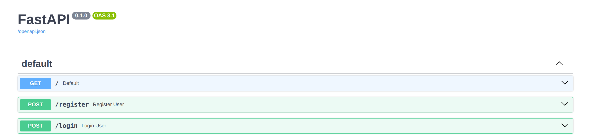

# CPSC 449 - Project 2

## Enrollments Service to manage course enrollment and waiting lists with functionality similar to CSUF TitanOnline using FastAPI.

## Users Service is a new user authentication service with read replication, and then implementing authentication using JWT and load balancing through an API gateway

## REST API ENDPOINTS
### Available REST API endpoints for the project

## Enrollments Service


</br>

Allow students to:
* List available classes
* Attempt to enroll in a class
* Drop a class
* View their current position on the waiting list
* Remove themselves from a waiting list

Allow Instructors to:
* View current enrollment for their classes
* View students who have dropped the class
* Drop students administratively (e.g. if they do not show up to class)
* View the current waiting list for the course
  
Allow Registrar to:
* Add new classes and sections
* Remove existing sections
* Change the instructor for a section
* Freeze automatic enrollment from waiting lists (e.g. during the second week of classes)

## Users Service


</br>
  
Allow Users to:
* Register a new user
* Check a user's password

## Installation
1. Clone this project
2. Install dependencies using "pip install -r requirements.txt"
3. Run database seed script (pro_db.py) using "python pro_db.py"

## Run this project
   
On Linux (using foreman)
1. Install Foreman
```
   sudo apt update 
   sudo apt install --yes ruby-foreman 
```
2. Run this command
```
foreman start -m primary=1,enrollments=3,krakend=1,secondary_1=1,secondary_2=1
```
